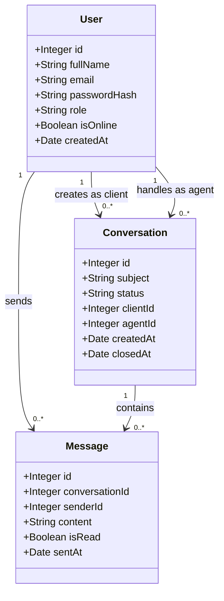

# Class Diagram — ChatBit

```mermaid
classDiagram

    class User {
        +Integer id
        +String fullName
        +String email
        +String passwordHash
        +String role
        +Boolean isOnline
        +Date createdAt
    }

    class Conversation {
        +Integer id
        +String subject
        +String status
        +Integer clientId
        +Integer agentId
        +Date createdAt
        +Date closedAt
    }

    class Message {
        +Integer id
        +Integer conversationId
        +Integer senderId
        +String content
        +Boolean isRead
        +Date sentAt
    }

    User "1" --> "0..*" Conversation : creates as client
    User "1" --> "0..*" Conversation : handles as agent
    User "1" --> "0..*" Message : sends
    Conversation "1" --> "0..*" Message : contains
```