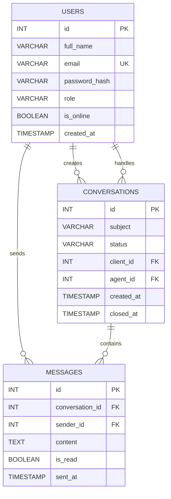

# ERD — ChatBit

```mermaid
erDiagram

    USERS {
        INT id PK
        VARCHAR full_name
        VARCHAR email UK
        VARCHAR password_hash 
        VARCHAR role
        BOOLEAN is_online
        TIMESTAMP created_at
    }

    CONVERSATIONS {
        INT id PK
        VARCHAR subject
        VARCHAR status
        INT client_id FK
        INT agent_id FK
        TIMESTAMP created_at
        TIMESTAMP closed_at
    }

    MESSAGES {
        INT id PK
        INT conversation_id FK
        INT sender_id FK
        TEXT content
        BOOLEAN is_read
        TIMESTAMP sent_at
    }

    USERS ||--o{ CONVERSATIONS : creates
    USERS ||--o{ CONVERSATIONS : handles
    USERS ||--o{ MESSAGES : sends
    CONVERSATIONS ||--o{ MESSAGES : contains
```