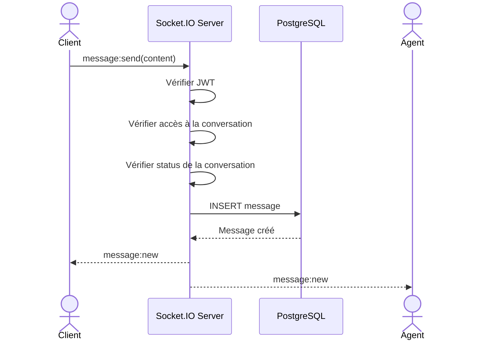

# Sequence Diagram — Message

```mermaid
sequenceDiagram

    actor Client
    participant Socket as Socket.IO Server
    participant DB as PostgreSQL
    actor Agent

    Client->>Socket: message:send(content)

    Socket->>Socket: Vérifier JWT
    Socket->>Socket: Vérifier accès à la conversation
    Socket->>Socket: Vérifier status de la conversation

    Socket->>DB: INSERT message
    DB-->>Socket: Message créé

    Socket-->>Client: message:new
    Socket-->>Agent: message:new
```