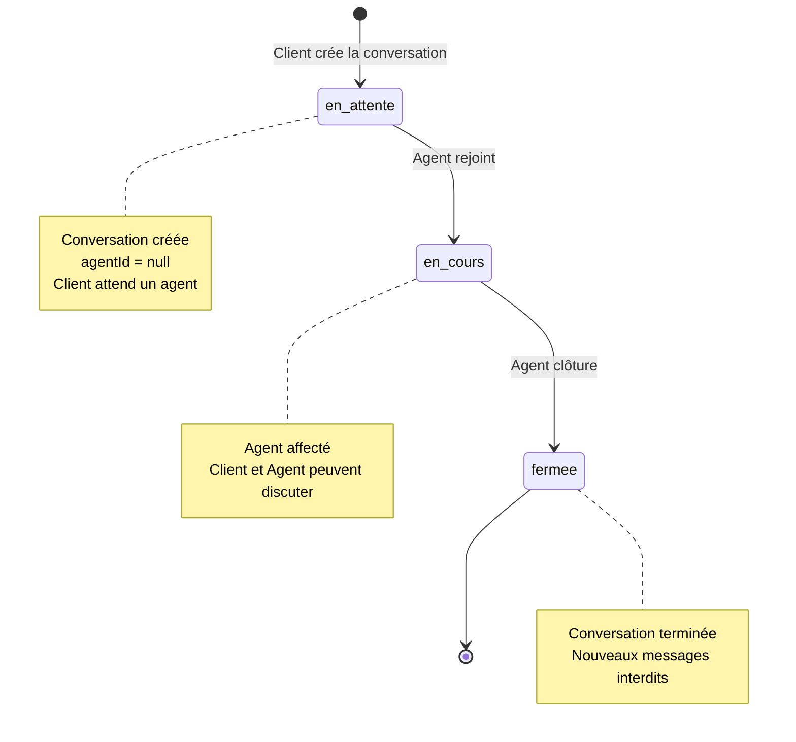

# State Diagram — Conversation

```mermaid
stateDiagram-v2

    [*] --> en_attente : Client crée la conversation

    en_attente --> en_cours : Agent rejoint

    en_cours --> fermee : Agent clôture

    fermee --> [*]

    note right of en_attente
        Conversation créée
        agentId = null
        Client attend un agent
    end note

    note right of en_cours
        Agent affecté
        Client et Agent peuvent discuter
    end note

    note right of fermee
        Conversation terminée
        Nouveaux messages interdits
    end note
```