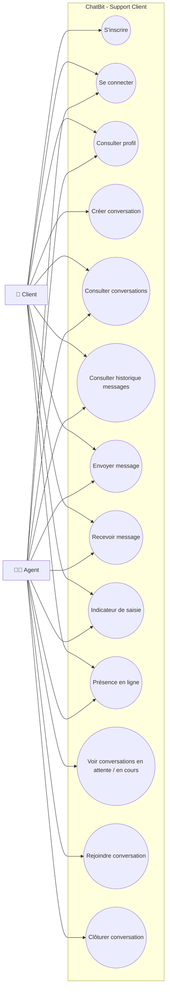

```mermaid
flowchart LR

    Client["👤 Client"]
    Agent["👨‍💼 Agent"]

    subgraph ChatBit["ChatBit - Support Client"]

        Register(("S'inscrire"))
        Login(("Se connecter"))
        Profile(("Consulter profil"))

        CreateConversation(("Créer conversation"))
        Conversations(("Consulter conversations"))
        History(("Consulter historique messages"))

        SendMessage(("Envoyer message"))
        ReceiveMessage(("Recevoir message"))

        Typing(("Indicateur de saisie"))
        Presence(("Présence en ligne"))

        Pending(("Voir conversations en attente / en cours"))
        Join(("Rejoindre conversation"))
        Close(("Clôturer conversation"))

    end

    Client --> Register
    Client --> Login
    Client --> Profile
    Client --> CreateConversation
    Client --> Conversations
    Client --> History
    Client --> SendMessage
    Client --> ReceiveMessage
    Client --> Typing
    Client --> Presence

    Agent --> Login
    Agent --> Profile
    Agent --> Conversations
    Agent --> History
    Agent --> SendMessage
    Agent --> ReceiveMessage
    Agent --> Typing
    Agent --> Presence
    Agent --> Pending
    Agent --> Join
    Agent --> Close
```